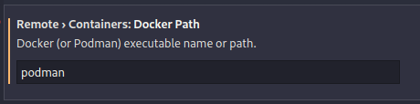
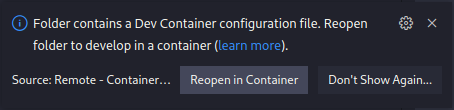

# VS Code Development Container: SYCL for NVIDIA GPUs via DPC++'s CUDA Backend

[](https://vscode.dev/redirect?url=vscode://ms-vscode-remote.remote-containers/cloneInVolume?url=https://github.com/sebp/vscode-sycl-dpcpp-cuda)

This project provides a **development container** for developing applications
in [SYCL](https://sycl.tech/) for NVIDIA GPUs using the [CUDA](https://developer.nvidia.com/cuda-toolkit)
backend of the [oneAPI DPC++](https://intel.github.io/llvm-docs/) (Data Parallel C++) compiler.

It uses [Podman](https://podman.io/) as container engine to run the
container rootless.

The setup has been tested on [Fedora Linux](https://getfedora.org/) 36 with Podman version 4.1.0.

## Prerequisites

Beside having installed Podman and VS Code, you need to setup the
NVIDIA Container Toolkit before being able to start the development container.

### Podman

You can install Podman on Fedora using
```
sudo dnf install -y podman
```

### NVIDIA Container Toolkit

The instructions to set up the [NVIDIA Container Toolkit](https://nvidia.github.io/nvidia-docker/) are based
on [this guide](https://www.redhat.com/en/blog/how-use-gpus-containers-bare-metal-rhel-8)
by Red Hat.

1. Install the [NVIDIA GPU driver](https://rpmfusion.org/Howto/NVIDIA) using RPM Fusion.
   Note that you do not need to install CUDA, it is included in the container.

2. Configure the repository:
```
curl -sL https://nvidia.github.io/nvidia-docker/rhel9.0/nvidia-docker.repo | sudo tee /etc/yum.repos.d/nvidia-docker.repo
```

3. Install the `nvidia-container-toolkit` package.
```
sudo dnf install -y nvidia-container-toolkit
```

4. To allow running the container rootless, you need to apply 3 changes to
   `/etc/nvidia-container-runtime/config.toml`.

```
#no-cgroups = false
no-cgroups = true
```

```
#ldconfig = "@/sbin/ldconfig"
ldconfig = "/sbin/ldconfig"
```

```
#debug = "/var/log/nvidia-container-runtime.log"
debug = "~/.local/nvidia-container-runtime.log"
```

5. Finally, install and apply a SELinux policy to enable GPU access within the container.
```
curl -sLO https://raw.githubusercontent.com/NVIDIA/dgx-selinux/master/bin/RHEL7/nvidia-container.pp
sudo semodule -i nvidia-container.pp
sudo nvidia-container-cli -k list | sudo restorecon -v -f -
sudo restorecon -Rv /dev
```

### Remote - Containers Extension

First install the [Remote - Containers](https://marketplace.visualstudio.com/items?itemName=ms-vscode-remote.remote-containers)
extension for [VS Code](https://code.visualstudio.com/).

By default, the extension is configured to use Docker, therefore you have to
go to user settings, Extensions, Remote - Containers, and change
`Remote › Containers: Docker Path` to `podman`.



## Usage

Once you followed the setup instructions above, open this project in VS Code
and you should see a prompt that suggests to reopen this project in a container.



The `src` folder contains an example program. You can compile it, and any other source file,
by opening the source file in VS Code and executing the build task by pressing `Ctrl+Shift+B`,
or open the Command Palette (`F1`, `Ctrl+Shift+P`) and search for **Run Build Task**.
Using the Command Palette, the compiled program can be executed via the **Run Test Task**.